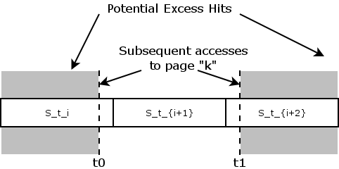
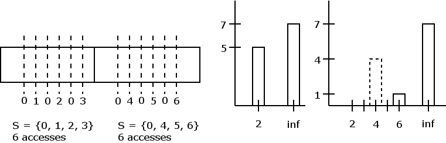

# Thoughts

**DISCLAIMER**: This is me basically sketching some ideas I had so I can put them in a more
coherent form later. This is not meant yet to be understandable by others. Proceed with 
caution :D

Originally, I had thought that sampling at a smaller time interval would yield strictly
better results, but I'm not so sure anymore. Here is an outline of my though process so far.

**Definition**: Let ``t: \mathbb{N} \to \mathbb{R}^+`` be a _time sequence_ if ``t_0 > 0`` 
and ``t_{i+1} > t_{i}``.

**Definition**: Define a _sample_ ``S`` as
```math
S_{t_i} = \{ k | \text{Page $k$ was active between $t_{i-1}$ and $t_{i}$} \}
```
be the set of pages of active pages on the time interval ``(t_{i-1}, t_{i}]`` where ``t`` is
a time sequence. As a syntactical choice, let ``S(t, 0) = \emptyset``.

**Definition** Define a _trace_ ``T = (S_{t_0}, S_{t_1}, \ldots S_{t_n})`` be an ordered
collection of samples.

What we would *like* to show is that if we have two time sequences ``t`` and ``t^{\prime}``
where ``t_{i+1} - t_i \leq t^{\prime} _{j+1} - t^{\prime} _{j}`` for all index pairs ``i`` and
``j``, (in other words, time sequence ``t`` has a smaller time interval than ``t^{\prime}``,
then ``t`` is somehow a better approximation of the ground truth of reuse distance. To do 
this, we need to define what we mean by reuse distance in the sense of discrete samples.

Let ``t_0`` and ``t_1`` denote the times between subsequent accesses to some page ``k``. 
Furthermore, suppose the time sequence ``t`` denoting our samples times is such that for some
index ``i``, ``t_{i-1} < t_0 \leq t_i`` and ``t_{i+1} < t_1 \leq t_{i+2}``. That is, the 
sampling periods look something like what we have below:



We have to be conservative and say that the reuse distance for page `k` at this time interval
is
```math
d(t, i+2, k) = \left| S_{t_i} \cup S_{t_{i+1}} \cup S_{t_{i+2}} \setminus {k} \right|
```
Now, we assume that page ``k`` is not accessed during ``S_{t_{i+`}}``. One source of error
comes from over counting unique accesses on either side of the samples containing the page
of interest.

If subsequent accesses to page ``k`` are recorded in ``S_{t_i}`` and ``S_{t_j}``, then a
bound on the error in the reuse distance calculation is
```math
E = | S_{t_i} \cup S_{t_j} \setminus {k} | = | S_{t_i} \cup S_{t_j} | - 1
```
(Side note for further clarification, this works if we think of an oracle sampling function
``t^*`` where ``|S_{t^* _i}| = 1`` for all valid ``i``. I.E., a perfect trace).

This is not taking into acount sub-sampling-frame rehits. 

## A pathological example

Consider the following pathological example:



Here, we have two sampling periods, with the exact sequence of page hits shown by the 
vertical bars. The exact trace histogram is shown on the left, with the one generated by the
approximation shown on the right. The dashed bar is the approximated histogram is all 
subpage accesses are recorded.

## Error Terms

Let ``t_i`` and ``t_j`` be sample times for subsequent accesses to page ``k``. If we use the
pessimistic distance formula, than the error in the reuse distance is
```math
| S_{t_i} \cup S_{t_j} | - 1
```
Let `r_{t_i}` be the number of repeated accesses in `S_{t_i}`. Then the error here is
```math
r_{t_i} (|S_{t_i}| - 1)
```

## Idea

We can actually generate a lower bound AND an upper bound for reuse distance via sampling.
